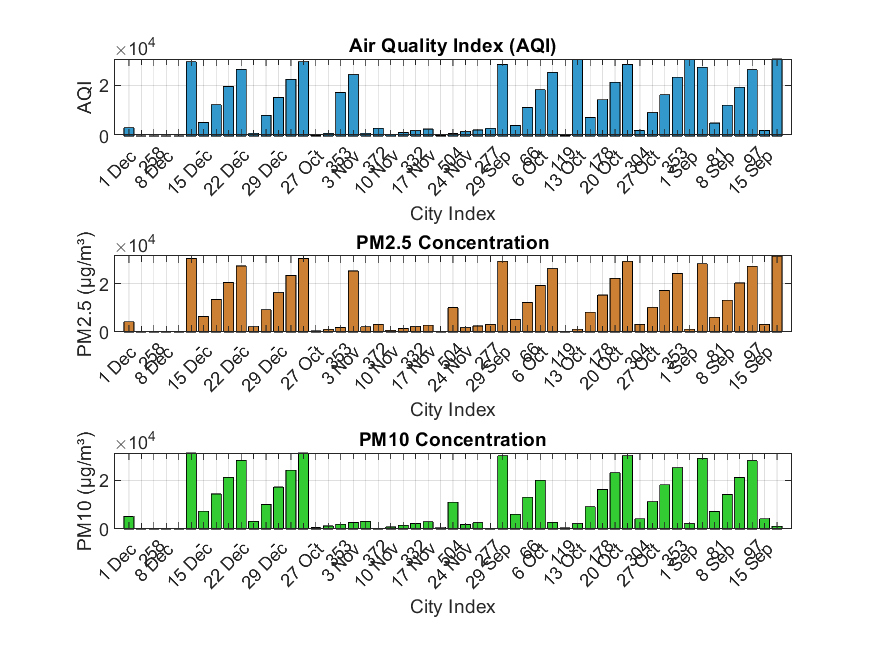

# Air Quality Index (AQI) Analysis


## 📘 Project Overview

This project analyzes **Air Quality Index (AQI)** data using **MATLAB** to monitor pollution levels across different cities. It collects real-time data through web scraping, processes it for pollutants like **PM2.5** and **PM10**, and visualizes the results to identify environmental trends and patterns.

The work demonstrates how MATLAB can integrate **data scraping, processing, and visualization** to support environmental awareness and data-driven decision-making.

---

## 🎯 Objectives

* Extract real-time AQI data using MATLAB’s web scraping functions.
* Process pollutant data (PM2.5 and PM10) for different time intervals.
* Visualize air quality trends using graphical plots.
* Provide meaningful insights into pollution levels and their variations across regions.

---

## 🧰 MATLAB Components Used

1. **Web Scraping Tools**

   * Functions: `webread`, `htmlTree`, `extractHTMLText`
   * Used to collect real-time AQI data from web sources.

2. **Data Processing**

   * Applied string manipulation and data conversion to clean and structure the data.

3. **Visualization Tools**

   * MATLAB’s plotting and bar graph functions to visualize AQI, PM2.5, and PM10 concentrations.

---

## 📊 Output Visualizations

Below is one of the generated outputs representing AQI and pollutant concentration levels:



Additional plots include:

* **PM2.5 Concentration:** `pm25_plot.png`
* **PM10 Concentration:** `pm10_plot.png`
* **Air Quality Graph Overview:** `air_quality_graph.png`

These visualizations help assess the air quality variations across different dates and cities.

---

## 🚀 Outcome

* Successfully extracted, processed, and visualized AQI data using MATLAB.
* Highlighted pollution intensity through comparative analysis of PM2.5 and PM10.
* Demonstrated efficient integration of web scraping and visualization in MATLAB.
* Provided data-driven insights into air quality monitoring.

---

## 🔮 Future Scope

* Automate AQI data collection for continuous real-time updates.
* Integrate **machine learning models** to predict AQI fluctuations.
* Expand the dataset to include other pollutants (e.g., CO, NO₂, SO₂).
* Create a web dashboard for real-time AQI monitoring.

---

## 👨‍💻 Contributor

**Vishesh Jindal**

---

## 📂 File Structure

```
├── air_quality_data.csv       # Cleaned AQI dataset in CSV format
├── air_quality_data.mat       # MATLAB data file for analysis
├── air_quality_data.txt       # Text data for AQI values
├── air_quality_graph.png      # Combined AQI and pollutant visualization
├── aqi_plot.png               # AQI bar graph
├── pm25_plot.png              # PM2.5 concentration plot
├── pm10_plot.png              # PM10 concentration plot
└── README.md                  # Project documentation
```

---

## 🧩 How to Run

1. Open MATLAB and load all the files from the repository.
2. Run the main MATLAB script for AQI analysis.
3. Generated plots (`aqi_plot.png`, `pm25_plot.png`, `pm10_plot.png`) will be saved automatically.
4. Use the plots to visualize and compare air quality metrics over time.

---

## 🧠 Keywords

`AQI` · `Air Pollution` · `PM2.5` · `PM10` · `MATLAB` · `Data Visualization` · `Environmental Analysis`
